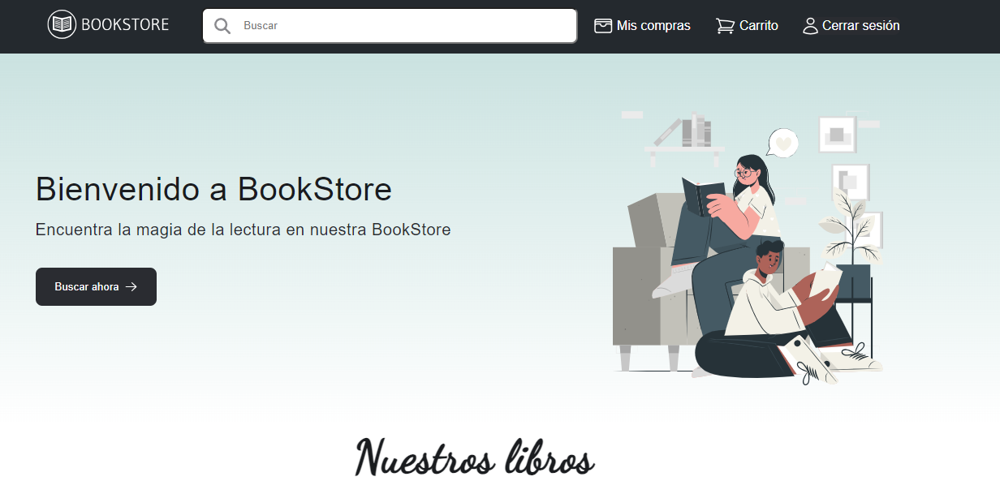

<br/>
<p align="center">
  
  <h2 align="center">Library with Angular</h2>

  <p align="center">
    A simple website that simulates a bookstore
    <br/>
    <br/>
  </p>
</p>

<!-- ## Table Of Contents -->

<!-- - [Table Of Contents](#table-of-contents)
- [About The Project](#about-the-project)
- [Built With](#built-with)
- [Getting Started](#getting-started)
  - [Prerequisites](#prerequisites)
  - [Installation](#installation)
- [Usage](#usage)
- [Roadmap](#roadmap)
- [Contributing](#contributing)
  - [Creating A Pull Request](#creating-a-pull-request)
- [License](#license)
- [Authors](#authors)
- [Acknowledgements](#acknowledgements) -->

## About The Project



This project was made as an assignment. 
You can register users, simulate purchases, see the purchases made by a user. It also has a shopping cart system as well as an authentication system made with the help of the backend.
In order to this project to work properly, it will need a rest api that you can find on this [github repository](https://github.com/Daniel07Navarro/biblioteca-api-rest-lpII)

## Building this project

### Prerequisites

- Nodejs
- NPM package manager

### How to build it
In order to have this project running on your pc you will need to follow these instructions:

- Clone this repository
```sh
git clone https://github.com/Thgear27/library_with_angular.git
```

- Navigate to the repository cloned
```sh
cd library_with_angular
```

- If you dont have the Angular CLI, you can install it by running this command
```sh
npm install -g @angular/cli
```

- Once you have the Angular CLI installed, run this command to install all the dependencies

```sh
npm install
```

- Now you are ready to run this project, just run the following comand
```sh
ng serve --open
```